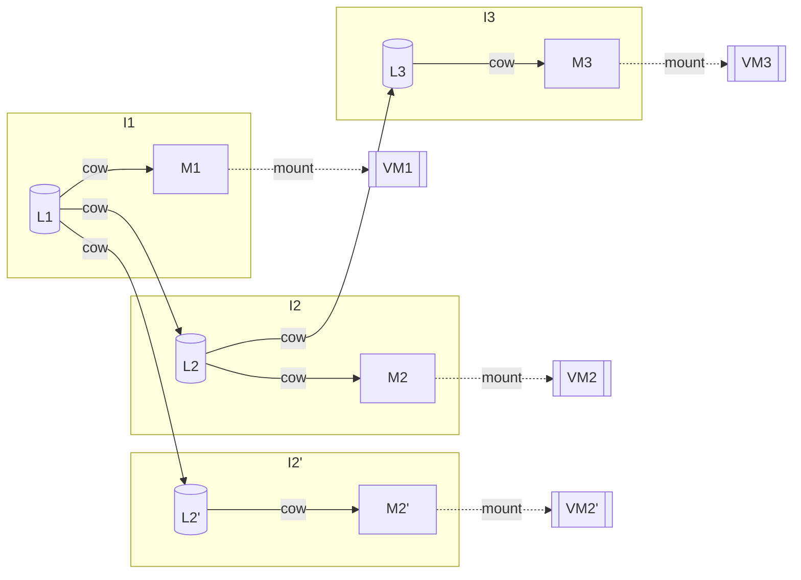

# Architecture

This document briefly outlines the architecture of `Hyper`.

## Layers and Images

Each layer acts as a COW block device on top of another layer. Three types of
layers exist:

  - **Base layers** are layers which are _immutable_, and require no parent
    layer to represent the full state of an immutable _image_.
  - **Intermediate layers** are _immutable_ layers which record the difference
    state between two states. As an example, if `L1` is a base layer, and `L2`
    is an intermediate layer on top of it, the composition of these two layers
    is a block device containing state of taking `L1` and applying the writes
    in `L2`.
  - **Mutable layers** are ephemeral layers which support writes, and may, or
    may not be converted into **intermediate layers**.

An image is defined as a chain of layers. For an image to be legal, the first
layer in the chain **must** be a base layer. There may be an arbitrary number
of intermediate layers. A **mutable image** is an image in which the last
layer is a **mutable layer**.

In algebraic terms, layers compose as a _semi-group_ into an _image_, and it is
legal to observe an image as merely an application of the layer composition
operation onto an image and a layer, recursively:

$$
I_i = \begin{cases}
B & i = 0 \\
I_{i-1} \cdot L_i & \text{ else}
\end{cases}
$$

This mechanism supports mounting mutable images `I` into VMs. The value add of
doing this fragmented, COW-style operations is twofold:

  - We significantly reduce the amount of memory necessary to store each image
    by only really storing the diffs between each layer.
  - We significantly speed up the forking operation.

A helpful illustration of layers and images is given here, as well as how they
are mounted into VMs:



### Storage

Hyper expects your layers and images to be stored in a shared pool filesystem.
This filesystem must contain images `I.img`, `L.img`, etc. The directory
structure of this filesystem follows that of a flat directory structure, so you
can back this with any of [NFS](https://wiki.archlinux.org/title/NFS), [S3
Files](https://aws.amazon.com/s3/features/files/),
[Archil](https://archil.com/), [Mesa](https://mesa.dev/) or any other
filesystem. The author uses the local filesystem for debugging, and NFS for
production use. This medium is referred to as the **layer storage medium**.

A side-car PostgreSQL database stores:

  - The dependency relationships between each individual layer and image.
  - Leases issued out to virtual machines to track which layers are currently
    considered active.

The aforementioned PostgreSQL database is coined the **metadata database**.

### Composition

Composing layers and images is a surprisingly non-trivial task and we describe
here how it has been achieved. When attempting to compose a chain of layers
`[:b, :l1, :l2, :m]` where `:b` refers to the base layer, `:l*` refer to
intermediate layers and `:m` refers to the mutable layer, `Hyper` employs the
following strategy:

  1. The base layer, `B.img` is first mounted as a loopback block device via
     `losetup`. This results in a `/dev/loop*` block device, call it
     `/dev/loopB`.
  2. All intermediate layers, `L1.img`, `L2.img` are mounted as loopback block
     devices into `/dev/loopL1`, `/dev/loopL2`.
  3. The image `I` containing `[:b, :l1, :l2]` (but not `:m`), is composed
     through `dev-snapshot`. This results in a `/dev/mapper` block device, call
     it `/dev/mapper/I`.
  4. Finally, a mutable layer `:m` is attached on top of `/dev/mapper/I` via
     `dm-thin`. This creates a mutable layer on top of the `I` image, which can
     be given to firecracker to run the VM.

## Nodes

`Hyper` is designed as a distributed system, which allows you to add compute to
the cluster, on-demand. As your workload increases, `Hyper` allows you to add
more nodes. `Hyper` itself, currently, does not add additional nodes, but will
automatically distribute workloads across your cluster, as required.

## VM Specs

Virtual machines have a spec that they are identified with. Each machine has a
set of pre-configured specs defined in `Hyper.Vm.Instance.specs` that describe
the absolute maximum limits that the given machine can have. For example, the
base image has the following spec:

```elixir
base: %Spec{
  vcpus: 4,
  mem: Information.mib(2048),
  disk: Information.gib(32),
  disk_bw: Bandwidth.mibps(256),
  net_bw: Bandwidth.mibps(128)
}
```

The configurable values are:

| Value     | Description |
|-----------|-------------|
| `vcpus`   | A fractional value of how many CPU cores a machine may consume. Note that this is potentially a value less than `1`, as we can allocate fractions of a CPU's scheduling time |
| `mem`     | The absolute maximum RAM a machine can allocate. |
| `disk`    | The absolute maximum disk usage a machine can use. |
| `disk_bw` | The absolute maximum disk bandwidth a machine can use. |
| `net_bw`  | The absolute maximum network bandwidth a machine use. |

### Budgets

Two categories of budgets $\alpha$ and $\beta$ are defined
on a per VM-basis.

$\alpha$ budgets measure the resources **required** to execute this VM. Two
types of the hard budget exist $\alpha_{\text{mem}}(\texttt{VM})$ and
$\alpha_{\text{disk}}(\texttt{VM})$. In order for a node `N` to be able to support
executing a `VM`, it **must** have at least $\alpha_{\text{mem}}(\texttt{VM})$ and
$\alpha_{\text{disk}}(\texttt{VM})$ of memory and disk space available for use.
Breaking any of these invariants results in VMs potentially crashing, as they
use up memory or disk space, potentially in unexpected ways.

On the other hand, the $\beta$ category of budgets enables
overloading nodes with VMs. Exceeding a soft budget on the node results in a
speed degradation, but it does not result in a service degradation. It is in
this category that `vcpus`, `disk_bw` and `net_bw` fit.

To summarize budgets:

| Value     | Budget Category | Overloading Impact                       |
|-----------|-----------------|------------------------------------------|
| `vcpus`   | $\beta$         | All VMs on the node experience slowdown. |
| `mem`     | $\alpha$        | VMs spuriously crash.                    |
| `disk`    | $\alpha$        | VMs spuriously crash.                    |
| `disk_bw` | $\beta$         | Disk speed is degraded on all VMs.       |
| `net_bw`  | $\beta$         | Network speed is degraded on all VMs.    |

Each node measures its own budget at any given state. Hard budgets are measured
by simply tracking which VMs are currently running, and what their specs are,
effectively:

$$
\alpha_m(N) = \alpha^{\text{total}}_m(N) - \sum_{\texttt{VM}} \alpha_m(\text{spec}(\texttt{VM}))
$$

The soft budget is more involved and requires real-time monitoring of the
active load on any node.

<!-- TODO(markovejnovic): Describe this -->


## Scheduling

The process of deciding which node `N` to deploy a `VM` is referred to as
**scheduling** in `Hyper`.

### Hard Budget

Out of the set of nodes $\mathbb{N}$, we first filter out nodes which do not
have the hard budget to run the given VM. Note we do not filter machines out of
soft budget yet. The set of nodes with available hard budget is:

$$
\text{possible}\left(\mathbb{N}, \texttt{VM}\right) = \left\lbrace
N \in \mathbb{N} \text{ if }
\bigwedge_{m \in \alpha} \left( \alpha_m(\texttt{VM}) < \alpha_m(N) \right)
\right\rbrace
$$

### Colocation

Since the layer storage medium is many orders of magnitude larger than the
NVMe drives on each node, there is a desirable property in colocating VMs on
machines that already have the pre-requisite layers loaded, as that enables
avoiding the relatively long and painful download of each layer.

> A further optimization, as it turns out, exists -- colocation can be improved
> not only by spawning VMs on nodes that have layers mounted, but by also
> colocating VMs on nodes which have _recently_ had the required layers
> mounted.
>
> At current, a layer is considered mounted if the layers are all mounted as
> block devices. The net result is that even though a block device is umounted
> (and by proxy -- `Hyper` believes the layer is not locally available), the
> shared layer medium may cache the data itself, which could be useful to
> speed up bootup.
>
> It is worth noting that in this document, the author hand-waves what
> "caching a layer" means -- many network-attached media cache at the block
> layer, so in certain cases it is more valuable to ask "how much of an image
> is cached".
>
> This is considered a future improvement.


