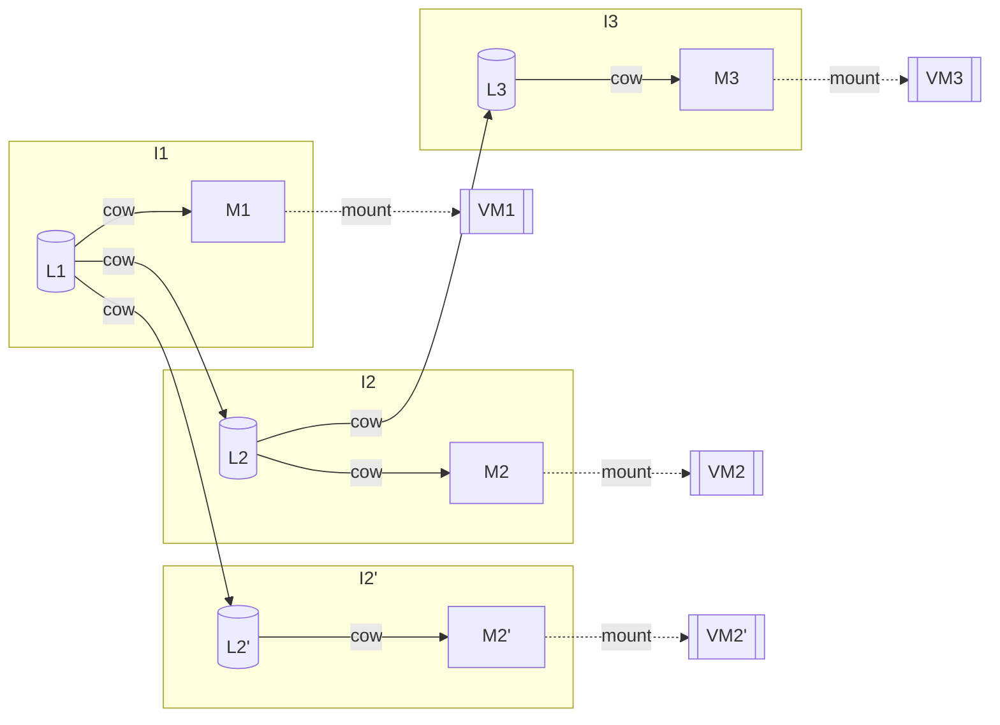

# Architecture

This document briefly outlines the architecture of `Hyper`.

## Layers and Images

Each layer acts as a COW block device on top of another layer. Three types of
layers exist:

  - **Base layers** are layers which are _immutable_, and require no parent
    layer to represent the full state of an immutable _image_.
  - **Intermediate layers** are _immutable_ layers which record the difference
    state between two states. As an example, if `L1` is a base layer, and `L2`
    is an intermediate layer on top of it, the composition of these two layers
    is a block device containing state of taking `L1` and applying the writes
    in `L2`.
  - **Mutable layers** are ephemeral layers which support writes, and may, or
    may not be converted into **intermediate layers**.

An image is defined as a chain of layers. For an image to be legal, the first
layer in the chain **must** be a base layer. There may be an arbitrary number
of intermediate layers. A **mutable image** is an image in which the last
layer is a **mutable layer**.

In algebraic terms, layers compose as a _semi-group_ into an _image_, and it is
legal to observe an image as merely an application of the layer composition
operation onto an image and a layer, recursively:

$$
I_i = \begin{cases}
B & i = 0 \\
I_{i-1} \cdot L_i & \text{ else}
\end{cases}
$$

This mechanism supports mounting mutable images `I` into VMs. The value add of
doing this fragmented, COW-style operations is twofold:

  - We significantly reduce the amount of memory necessary to store each image
    by only really storing the diffs between each layer.
  - We significantly speed up the forking operation.

A helpful illustration of layers and images is given here, as well as how they
are mounted into VMs:



### Storage

Hyper expects your layers and images to be stored in a shared pool filesystem.
This filesystem must contain images `I.img`, `L.img`, etc. The directory
structure of this filesystem follows that of a flat directory structure, so you
can back this with any of [NFS](https://wiki.archlinux.org/title/NFS), [S3
Files](https://aws.amazon.com/s3/features/files/),
[Archil](https://archil.com/), [Mesa](https://mesa.dev/) or any other
filesystem. The author uses the local filesystem for debugging, and NFS for
production use. This medium is referred to as the **layer storage medium**.

A metadata database stores:

  - The dependency relationships between each individual layer and image.
  - Leases issued out to virtual machines to track which layers are currently
    considered active.

The aforementioned database is coined the **metadata database**. Two backends
are available; see [Image-graph storage backends](#image-graph-storage-backends)
below for how to choose one.

### Image-graph storage backends

The image graph (blobs, images, image-layers, leases) is stored through the
`Hyper.Img.Db.Repo` facade. At runtime `Hyper.Img.Db.Backend` resolves that
facade to one of two concrete backends:

- **`:postgres`** (default) -- cluster-safe; required for any multi-node
  deployment.
- **`:sqlite`** -- a single-writer file database for single-node deployments
  only. Selected via:

  ```elixir
  config :hyper, Hyper.Img.Db, backend: :sqlite
  ```

SQLite **must not** be used on a clustered node. `Hyper.Img.Db.SingleNodeGuard`
enforces this automatically:

- At startup the node refuses to boot if any peers are already connected.
- At runtime the node halts itself (via `System.stop/1`) if a peer joins while
  SQLite is active.

This hard enforcement protects the SQLite file from concurrent writers, which
would corrupt the metadata database.

#### Migrations

Both backends share `priv/repo/migrations` -- the DDL is written to be portable
across PostgreSQL and SQLite. Apply migrations per backend:

    mix ecto.migrate -r Hyper.Img.Db.Repo.Postgres   # default (multi-node)
    mix ecto.migrate -r Hyper.Img.Db.Repo.Sqlite     # single-node SQLite

#### Known limitation: upsert id under SQLite

On SQLite (via `ecto_sqlite3`), an `ON CONFLICT DO UPDATE` upsert returns a
struct carrying a freshly-generated UUID rather than the stored row's `id`.
`Hyper.Img.Db.Lease.bump/3` is the only upsert in the image-graph path, and
current callers only match `{:ok, _}` without reading back the lease `id`, so
there is no live bug. However, any future code that reads the `id` from the
struct returned by a lease bump under SQLite will receive an incorrect value.
Use the Postgres backend if you need reliable round-trip identity on bumped
leases.

### Composition

Composing layers and images is a surprisingly non-trivial task and we describe
here how it has been achieved. When attempting to compose a chain of layers
`[:b, :l1, :l2, :m]` where `:b` refers to the base layer, `:l*` refer to
intermediate layers and `:m` refers to the mutable layer, `Hyper` employs the
following strategy:

  1. The base layer, `B.img` is first mounted as a loopback block device via
     `losetup`. This results in a `/dev/loop*` block device, call it
     `/dev/loopB`.
  2. All intermediate layers, `L1.img`, `L2.img` are mounted as loopback block
     devices into `/dev/loopL1`, `/dev/loopL2`.
  3. The image `I` containing `[:b, :l1, :l2]` (but not `:m`), is composed
     through `dev-snapshot`. This results in a `/dev/mapper` block device, call
     it `/dev/mapper/I`.
  4. Finally, a mutable layer `:m` is attached on top of `/dev/mapper/I` via
     `dm-thin`. This creates a mutable layer on top of the `I` image, which can
     be given to firecracker to run the VM.

## Nodes

`Hyper` is designed as a distributed system, which allows you to add compute to
the cluster, on-demand. As your workload increases, `Hyper` allows you to add
more nodes. `Hyper` itself, currently, does not add additional nodes, but will
automatically distribute workloads across your cluster, as required.

## VM Specs

Virtual machines have a spec that they are identified with. Each machine has a
set of pre-configured specs defined in `Hyper.Vm.Instance.specs` that describe
the absolute maximum limits that the given machine can have. For example, the
base image has the following spec:

```elixir
base: %Spec{
  vcpus: 4,
  mem: Information.mib(2048),
  disk: Information.gib(32),
  disk_bw: Bandwidth.mibps(256),
  net_bw: Bandwidth.mibps(128)
}
```

The configurable values are:

| Value     | Description |
|-----------|-------------|
| `vcpus`   | A fractional value of how many CPU cores a machine may consume. Note that this is potentially a value less than `1`, as we can allocate fractions of a CPU's scheduling time |
| `mem`     | The absolute maximum RAM a machine can allocate. |
| `disk`    | The absolute maximum disk usage a machine can use. |
| `disk_bw` | The absolute maximum disk bandwidth a machine can use. |
| `net_bw`  | The absolute maximum network bandwidth a machine use. |

### Budgets

Two categories of budgets $\alpha$ and $\beta$ are defined
on a per VM-basis.

$\alpha$ budgets measure the resources **required** to execute this VM. Two
types of the hard budget exist $\alpha_{\text{mem}}(\texttt{VM})$ and
$\alpha_{\text{disk}}(\texttt{VM})$. In order for a node `N` to be able to support
executing a `VM`, it **must** have at least $\alpha_{\text{mem}}(\texttt{VM})$ and
$\alpha_{\text{disk}}(\texttt{VM})$ of memory and disk space available for use.
Breaking any of these invariants results in VMs potentially crashing, as they
use up memory or disk space, potentially in unexpected ways.

On the other hand, the $\beta$ category of budgets enables
overloading nodes with VMs. Exceeding a soft budget on the node results in a
speed degradation, but it does not result in a service degradation. It is in
this category that `vcpus`, `disk_bw` and `net_bw` fit.

To summarize budgets:

| Value     | Budget Category | Overloading Impact                       |
|-----------|-----------------|------------------------------------------|
| `vcpus`   | $\beta$         | All VMs on the node experience slowdown. |
| `mem`     | $\alpha$        | VMs spuriously crash.                    |
| `disk`    | $\alpha$        | VMs spuriously crash.                    |
| `disk_bw` | $\beta$         | Disk speed is degraded on all VMs.       |
| `net_bw`  | $\beta$         | Network speed is degraded on all VMs.    |

Each node measures its own budget at any given state. Hard budgets are measured
by simply tracking which VMs are currently running, and what their specs are,
effectively:

$$
\alpha_m(N) = \alpha^{\text{total}}_m(N) - \sum_{\texttt{VM}} \alpha_m(\text{spec}(\texttt{VM}))
$$

The soft budget is more involved and requires real-time monitoring of the
active load on any node. Unfortunately, it is impossible to predict what kind
of soft load any particular VM will cause. We define two soft thresholds:

  - An instantaneous soft-threshold $\beta_m^i(N) = k_m \beta_m^{\text{cap}}$
    with a tweakable $0 < k_m$ load coefficient. This expresses the idea of
    _we shall avoid scheduling on machines which have more than 80% load_.
  - A total maximal threshold which is capped at the same logic as $\alpha$,
    except that it is allowed to overflow full load:

$$
\beta_m^{\text{max}}(N) = k^{\text{max}}_m \beta^{\text{total}}_m(N) - \sum_{\texttt{VM}} \beta_m(\text{spec}(\texttt{VM}))
$$

The $\beta_m^{\text{max}}(N)$ value should never be exceeded, just as the
$\alpha_m(N)$ is never to be exceeded. On the other hand, the $\beta_m^i(N)$
value, acts as a cap -- if a machine is above that threshold, then no further
VMs can be scheduled. This acts as an instantaneous measurement.

## Scheduling

The process of deciding which node `N` to deploy a `VM` is referred to as
**scheduling** in `Hyper`.

### Hard Budget

Out of the set of nodes $\mathbb{N}$, we first filter out nodes which do not
have the hard budget to run the given VM. Note we do not filter machines out of
soft budget yet. The set of nodes with available hard budget is:

$$
\text{havail}\left(\mathbb{N}, \texttt{VM}\right) = \left\lbrace
N \in \mathbb{N} \text{ if }
\bigwedge_{m \in \alpha} \left( \alpha_m(\texttt{VM}) < \alpha_m(N) \right)
\right\rbrace
$$

### Soft Budgeting

With the hard budget nodes filtered out, we then subsequently filter out nodes
which have their theoretical soft budget exhausted.

$$
\text{savail}\left(\mathbb{N}, \texttt{VM}\right) = \left\lbrace
N \in \text{havail}\left(\mathbb{N}, \texttt{VM}\right) \text{ if }
\bigwedge_{m \in \beta} \left( \beta_m(\texttt{VM}) < \beta_m^{\text{max}}(N) \right)
\right\rbrace
$$

This leaves us with nodes which could theoretically support more nodes, but it
is important to note that some of these machines may already be overloaded, so
we filter out according to the instantaneous load:

$$
\text{possible}\left(\mathbb{N}, \texttt{VM}\right) = \left\lbrace
N \in \text{savail}\left(\mathbb{N}, \texttt{VM}\right) \text{ if }
\bigwedge_{m \in \beta} \left( \beta_m(N) < k_m \beta_m^{\text{cap}}(N) \right)
\right\rbrace
$$

### Colocation

Since the layer storage medium is many orders of magnitude larger than the
NVMe drives on each node, there is a desirable property in colocating VMs on
machines that already have the pre-requisite layers loaded, as that enables
avoiding the relatively long and painful download of each layer.

> A further optimization, as it turns out, exists -- colocation can be improved
> not only by spawning VMs on nodes that have layers mounted, but by also
> colocating VMs on nodes which have _recently_ had the required layers
> mounted.
>
> At current, a layer is considered mounted if the layers are all mounted as
> block devices. The net result is that even though a block device is umounted
> (and by proxy -- `Hyper` believes the layer is not locally available), the
> shared layer medium may cache the data itself, which could be useful to
> speed up bootup.
>
> It is worth noting that in this document, the author hand-waves what
> "caching a layer" means -- many network-attached media cache at the block
> layer, so in certain cases it is more valuable to ask "how much of an image
> is cached".
>
> This is considered a future improvement.

This effectively means sorting the list of possible nodes and picking the one
with the highest number of bytes already mounted.

Formally, let $\Lambda(\texttt{VM})$ be the set of layers in the image chain of
the VM, $\text{mnt}(N)$ the set of layers currently mounted on node $N$, and
$|L|$ the size of layer $L$ in bytes. The colocation score of a node is the
number of required bytes already resident on it:

$$
\text{colo}(N, \texttt{VM}) = \sum_{L \in \Lambda(\texttt{VM}) \cap \text{mnt}(N)} |L|
$$

The scheduler then deploys onto the highest-scoring node among the viable
candidates:

$$
\text{schedule}(\texttt{VM}) = \underset{N \in \text{possible}(\mathbb{N}, \texttt{VM})}{\operatorname{arg\,max}}\; \text{colo}(N, \texttt{VM})
$$

### Strategy

In total, the scheduling strategy is naive:

  1. Find all nodes for scheduling a new VM would not cause them to overfill
     their hard caps.
  2. Out of those nodes, find all nodes where scheduling a new VM would not
     cause them to overflow the theoretical maximal soft budget.
  3. Out of those nodes, find all nodes with their instantaneous soft loads
     are under the instantaneous soft load.
  4. Out of those nodes, sort them by the highest number of layer bytes that
     are already loaded in.
  5. Schedule on the first available machine.
